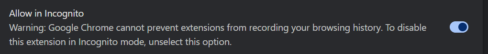
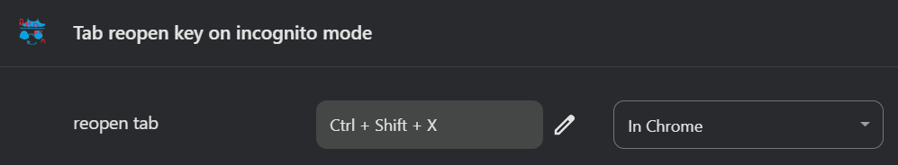

# Tab reopen key on incognito mode

## Setup

This extension can be downloaded from the [Chrome Web Store](https://chromewebstore.google.com/detail/tab-reopen-key-on-incogni/alkfhfgkepamooonkjdolamnbilhkmjg).

**After installing, be sure to configure the following two settings.**

### 1. Allow in Incognitos

Go to [chrome://extensions/?id=alkfhfgkepamooonkjdolamnbilhkmjg](chrome://extensions/?id=alkfhfgkepamooonkjdolamnbilhkmjg) and make sure `Allow in Incognito` is turned ON.

### 2. Setup a shortcut key

Go to [chrome://extensions/shortcuts](chrome://extensions/shortcuts) and look for `reopen tab` in the `Tab reopen key on incognito mode` section.

The default shortcut key, `Ctrl+Shift+X` should be set up right after you install, but **it might not be set** for some reasons.

Just make sure that any shortcut key is set here as shown below, and be careful not to interfere with other extensions' shortcut keys.

## FAQ 

- Q: Is this extension private?
    - A: Yes. This extension never sends any data. Just make sure this extension stores the URLs of incognito/regular tabs inside the extension.

- Q: Can I restore incognito tabs with history just like regular tabs?
    - A: Unfortunately, there's no way to restore an incognito session, so this extension will recreate the incognito tab with the last URL opened.

## Version history

### v1.1.0

- Fixed issues
    1. When the last incognito tab is closed and its parent window is closed at the same time, the parent window is lost and the tab cannot be restored.

- Set extension icon

- Modified description

### v1.0

- Initial release